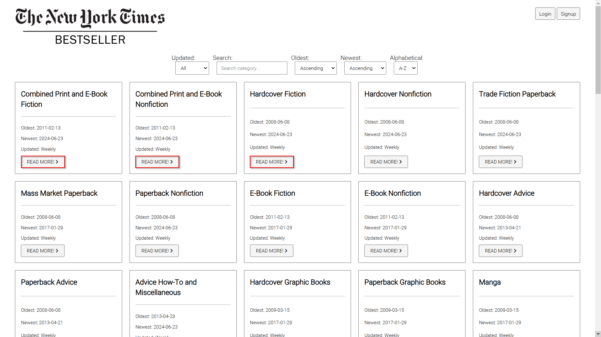
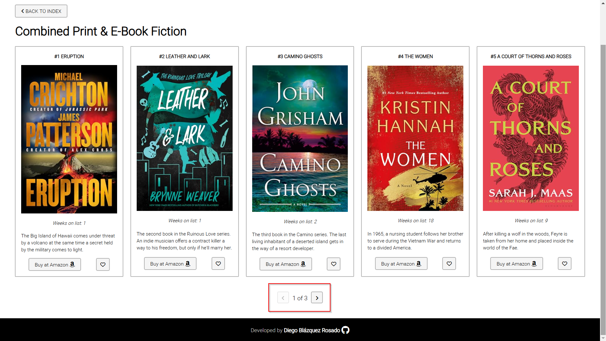
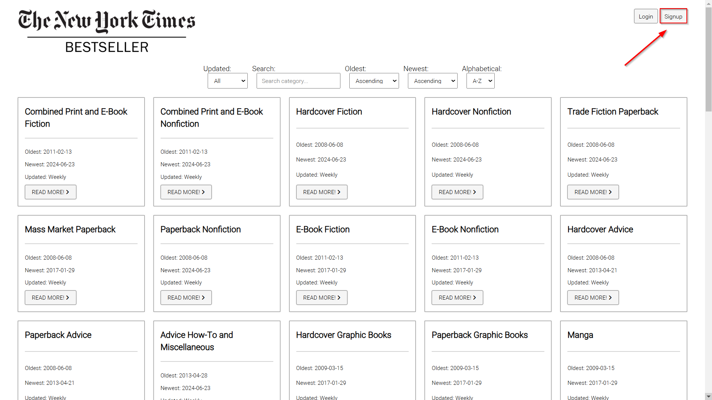
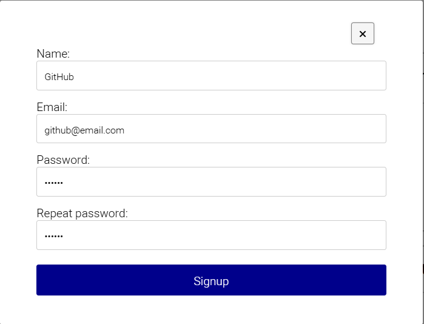
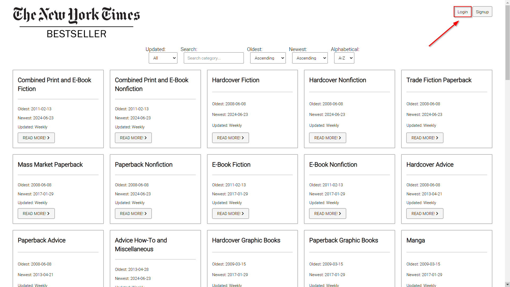
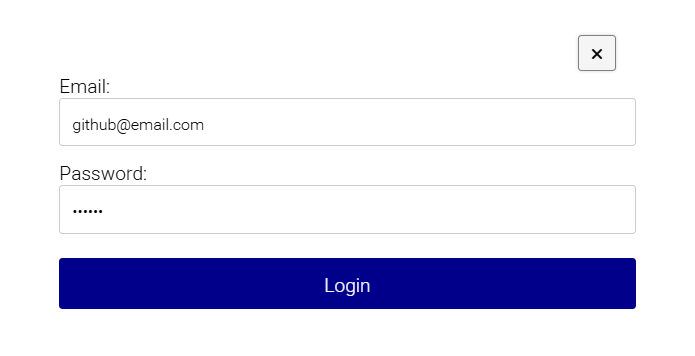
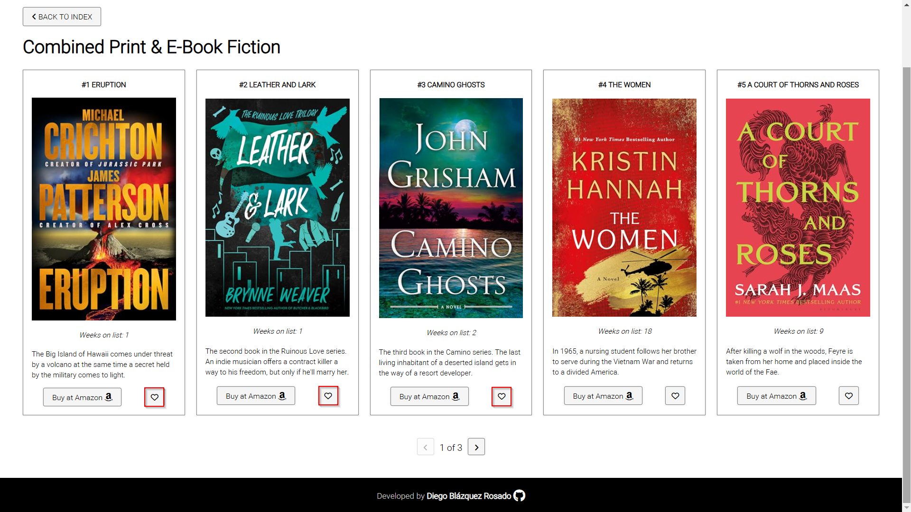
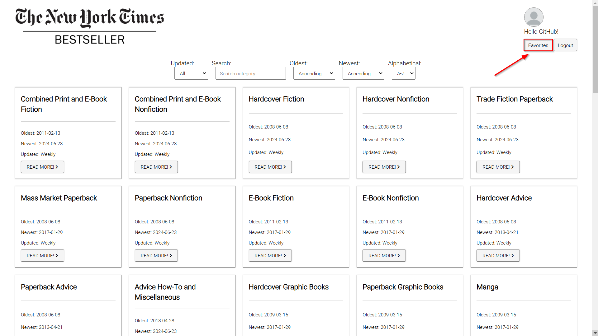
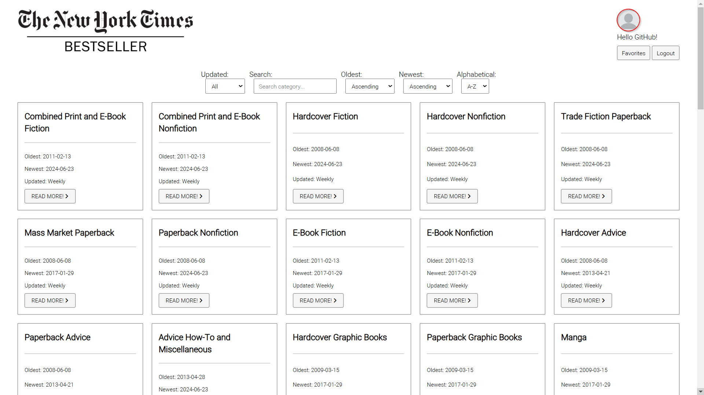
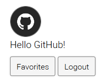

# Biblioteca / NYT Best Sellers

Esta aplicación web permite a los usuarios explorar los best sellers del New York Times categorizados por categoría. Las características principales incluyen:

* **Visualización de Libros por Categoría:** Los usuarios pueden ver los libros más vendidos organizados por diferentes categorías.

* **Filtros de Categorías:** La aplicación ofrece varios filtros para refinar la búsqueda de cada categoría.

* **Paginación de Libros:** Los usuarios pueden navegar fácilmente a través de los top 15 libros de cada categoría con una función de paginación intuitiva.

* **Compra en Amazon:** Cada libro tiene un botón que redirige a la página de compra en Amazon, facilitando la adquisición del libro deseado.

* **Creación de Usuario:** Los usuarios pueden registrarse para crear una cuenta.

* **Guardado de Libro en Favoritos:** Cada libro contiene un botón de favoritos para que los usuarios registrados puedan guardar los best sellers que más les haya gustado.

* **Gestión de Perfil:** Los usuarios registrados pueden cambiar su foto de perfil.

Esta aplicación proporciona una experiencia completa y personalizada para los amantes de los libros, facilitando la exploración y adquisición de las obras más populares según el New York Times.

## Cómo utilizar la aplicación

https://diegoblazquezr.github.io/Biblioteca/

Visualización de Libros por Categoría
1) En la página principal aparecerán las categorías de los libros.
2) Escoge la categoría que deseas explorar.
3) La aplicación mostrará una lista de los libros más vendidos en la categoría seleccionada.

Filtros de Categorías
1) Justo encima de las categorías podrás encontrar los filtros.
2) Se puede filtrar por: frecuencia de actualizado, búsqueda por texto/palabra, ordenar por fecha antigua/nueva de manera ascendete/descendente y por órden alfabético.
3) Selecciona los filtros que desees y la lista de libros se actualizará automáticamente para mostrar los resultados que coinciden con tus criterios.

Paginación de Libros
1) En la lista de libros, desplázate hacia la parte inferior de la página.
2) Usa los controles de paginación para moverte entre las diferentes páginas de libros disponibles.
3) Haz clic en el número de página o en los botones de "Siguiente" y "Anterior" para navegar por la lista.

Compra en Amazon
1) En la lista de libros, identifica el libro que deseas comprar.
2) Haz clic en el botón "Comprar en Amazon" junto al libro seleccionado.
3) Serás redirigido a la página de Amazon donde puedes completar la compra.

Creación de Usuario
1) Navega a la sección de registro en la esquina superior derecha y haz click en botón Signup.

2) Completa el formulario de registro con tu información personal.
3) Haz clic en el botón azul "Signup" para crear tu cuenta.

Inicio de Sesión
1) En caso de ya disponer de una cuenta, navegar a la esquina superior derecha y hacer click en el botón Login.

2) Completa el formulario de login con la información de tu cuenta.
3) Haz clic en el botón azul "Login" para iniciar sesión en tu cuenta.

Guardado de Libro en Favoritos
1) Para poder empezar a guardar favoritos necesitaras iniciar sesión en tu cuenta.
2) Una vez dentro, en la lista de libros, haz clic en el icono de corazón junto al libro que deseas guardar como favorito.

3) Accede a la sección de "Favoritos" en tu perfil para ver todos los libros guardados.

Gestión de Perfil
1) Inicia sesión en tu cuenta y en la esquina superior derecha.
2) Haz clic en la imagen de perfil.

4) Busca la foto de perfil por la que desees y haz click en Abrir.

## Tecnologías usadas
- HTML5
- CSS3
- JavaScript
- NYT Books API
- Firebase
- Fontawesome
- Google Fonts
